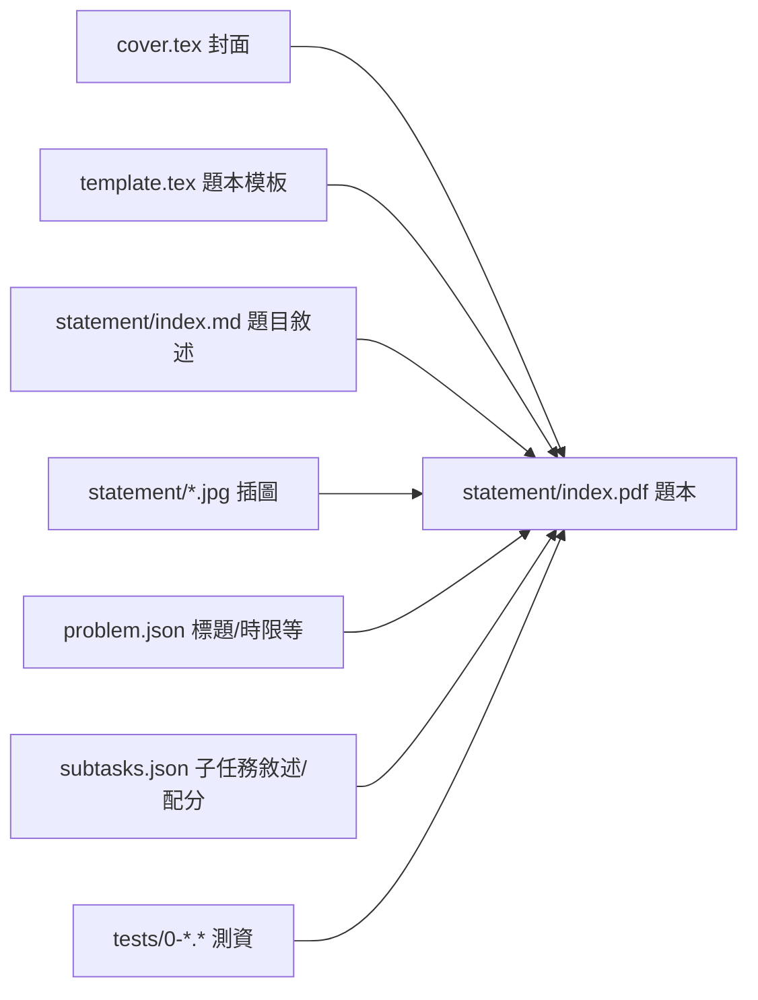
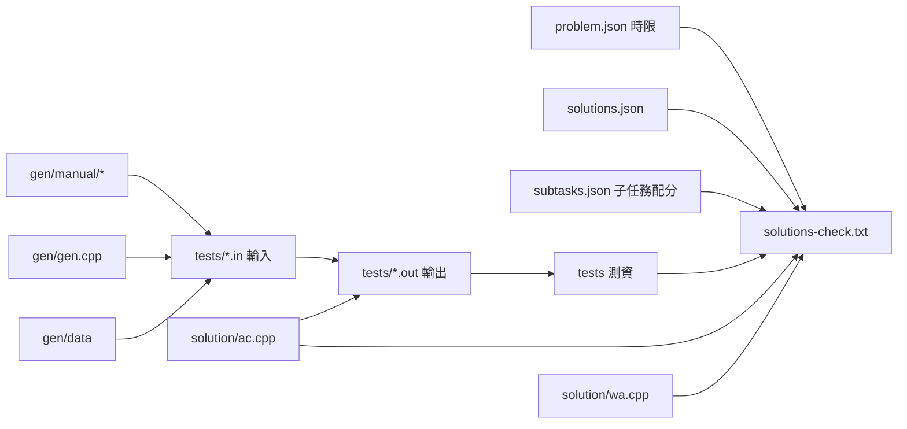

# TPS範例題目

- [ ] Test
- [ ] Test
- [ ] Test

## Quick Links
[problems.pdf](pA/attachments/problems.pdf)

## Quick Links

| problem | statement | gen | validator | solution | tests | config |
| --- | --- | --- | --- | --- | --- | --- |
| A | [statement](pA/statement) [md](pA/statement/index.md) [pdf](pA/statement/index.pdf) | [gen](pA/gen) | [validator](pA/validator) | [solution](pA/solution) [check](pA/solutions-check.txt) | [tests](pA/tests) | [problem](pA/problem.json) [solutions](pA/solutions.json) [subtasks](pA/subtasks.json) |
| B | [statement](pB/statement) [md](pB/statement/index.md) [pdf](pB/statement/index.pdf) | [gen](pB/gen) | [validator](pB/validator) | [solution](pB/solution) [check](pB/solutions-check.txt) | [tests](pB/tests) | [problem](pB/problem.json) [solutions](pB/solutions.json) [subtasks](pB/subtasks.json) |
<!-- new problem -->

## Subtasks
<!-- subtasks start -->
| | 1 | 2 | 3 |
| --- | --- | --- | --- |
| A | 20 $A = 0$、$1 \leq B \leq 10^{4}$ | 30 $0 \leq A, B \leq 10^{4}$ | 50 無額外限制 |
| B | 20 $A = 0$、$1 \leq B \leq 10^{4}$ | 30 $0 \leq A, B \leq 10^{4}$ | 50 無額外限制 |
<!-- subtasks end -->

